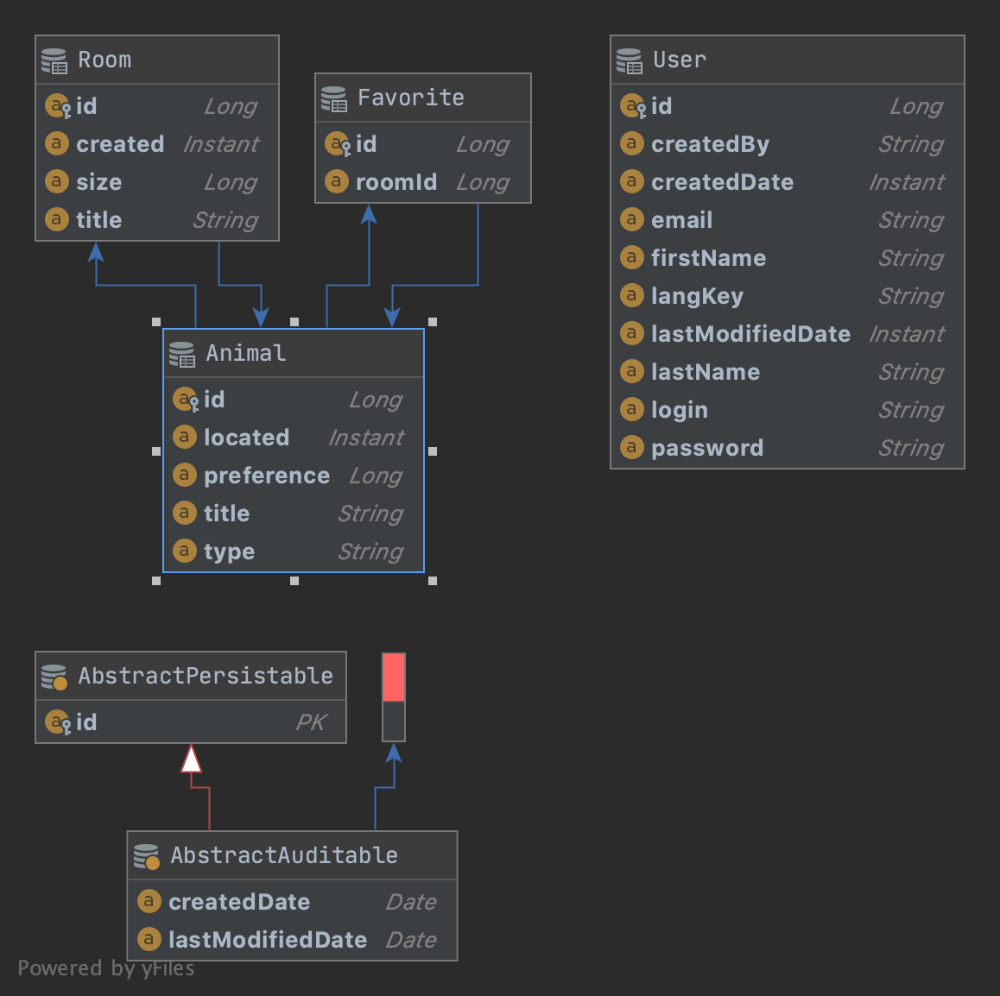

## Zoo Application

This application helps to  maintain the zoo. By placing animals in room and moving across zoo. User can use the endpoint provided to create animal,room and move the animals across.
## Tech Stack
1. Java 8
2. Spring Boot
3. Spring Data
4. Mysql (Dev/Prod)
5. H2(Integration Test)
5. Docker
6. Maven
7. JWT Security

## Setup

Download the project from the github and make sure that Maven/Docker installed. If not please follow the below steps to install it.
1. Maven Install - !(https://www.baeldung.com/install-maven-on-windows-linux-mac#:~:text=Installing%20Maven%20on%20Mac%20OS,%3A%20apache%2Dmaven%2D3.3.)
2. Docker Install - !(https://docs.docker.com/desktop/)

Mysql will be started in docker container automatically when you run scripts. Instructions given below

## Run Scripts
**Build Application:**
For Building the application execute the build.sh file which is located in [scripts](scripts) folder. From the terminal run the below cmd.
Refer to the [./consoleOutput.txt](./consoleOutput.txt) file in the project path for the execution result.
```
cd scripts
./scripts/build.sh

```
**Test Execution:**
For running the test case execute the runtest.sh file which is located in [scripts](scripts) folder. From the terminal run the below cmd.
Refer to the [./testRunConsoleOutput.txt](./testRunConsoleOutput.txt) file in the project path for the execution result.
```
cd scripts
./scripts/runtest.sh

```
**Start Server:**
For starting the server goto scripts path execute the run.sh file which is located in [scripts](scripts) folder. From the terminal run the below cmd.
Note that docker composes for mysql to start has been included in the script file.
```
cd scripts
./run.sh

```

Server will be started at port: 5678 . You can change the port number in [src/main/resources/application.yml](src/main/resources/application.yml) if required.
```$xslt
server:
  port: 5678
```

Make a POST request to `/authroize` with the default admin user we loaded from [src/main/resources/dataset/user.csv](src/main/resources/dataset/user.csv) file on application startup.

```
  $  curl --header "Content-Type: application/json" \
      --request POST \
      --data '{"username":"admin","password":"admin"}' \
      http://localhost:5678/authenticate

```

Add the JWT token you got with the above curl command as a Header parameter and make the call to endpoint. 
Below are the sample curl commands. 

CRUD Operation for Animal:
```
--Create - Id column will be autogenerated
curl --header "Content-Type: application/json"\
        --header "Authorization: Bearer <JWT_TOKEN>" \
        --request POST \
        --data '{"title":"Giraffe","located":"2020-07-15T12:54:59.00Z","type":"<=","preference":10}' \
        http://localhost:5678/api/animals

--Update - Id should be part of the json to update
curl --header "Content-Type: application/json"\
        --header "Authorization: Bearer <JWT_TOKEN>" \
        --request PUT \
        --data '{"id":1,title":"Giraffe","located":"2020-07-15T12:54:59.00Z","type":"<=","preference":10}' \
        http://localhost:5678/api/animals
--Read
curl --header "Content-Type: application/json"\
        --header "Authorization: Bearer <JWT_TOKEN>" \
        --request GET \
        http://localhost:5678/api/animals/1
--Delete
curl --header "Content-Type: application/json"\
        --header "Authorization: Bearer <JWT_TOKEN>" \
        --request DELETE \
        http://localhost:5678/api/animals/1
```

CRUD Operation for Room:
```
--Create - Id column will be autogenerated
curl --header "Content-Type: application/json"\
        --header "Authorization: Bearer <JWT_TOKEN>" \
        --request POST \
        --data '{"title":"YELLOW","size":15,"created":"2020-07-15T12:54:59.00Z"}' \
        http://localhost:5678/api/rooms

--Update - Id should be part of the json to update
curl --header "Content-Type: application/json"\
        --header "Authorization: Bearer <JWT_TOKEN>" \
        --request PUT \
        --data '{"id":52,title":"YELLOW","size":15,"created":"2020-07-15T12:54:59.00Z"}' \
        http://localhost:5678/api/rooms

--Read
curl --header "Content-Type: application/json"\
        --header "Authorization: Bearer <JWT_TOKEN>" \
        --request GET \
        http://localhost:5678/api/rooms/1

--Delete
curl --header "Content-Type: application/json"\
        --header "Authorization: Bearer <JWT_TOKEN>" \
        --request DELETE \
        http://localhost:5678/api/rooms/1
```

Place Animal to Room:
```
 curl --header "Content-Type: application/json"\
        --header "Authorization: Bearer <JWT_TOKEN>" \
        --request POST \
        --data '{"animalId": 52,"roomId": 1}' \
        http://localhost:5678/api/animal/place
```
Move Animal to another Room:
````
 curl --header "Content-Type: application/json"\
        --header "Authorization: Bearer <JWT_TOKEN>" \
        --request POST \
        --data '{"animalId": 52,"roomId": 1}' \
        http://localhost:5678/api/animal/move
````
Delete Animal from Room:
```
curl --header "Content-Type: application/json"\
       --header "Authorization: Bearer <JWT_TOKEN>" \
       --request DELETE http://localhost:5678/api/animal/remove/{52}
````
Assign Room as Favorite for animal:
````
curl --header "Content-Type: application/json"\
       --header "Authorization: Bearer <JWT_TOKEN>" \
       --request POST \
       --data '{"animalId": 52,"roomId": 2}' \
       http://localhost:5678/api/favorite/assign
````
UnAssign Room as Favorite for animal:
````
curl --header "Content-Type: application/json"\
       --header "Authorization: Bearer <JWT_TOKEN>" \
       --request DELETE \
       --data '{"animalId": 52,"roomId": 2}' \
       http://localhost:5678/api/favorite/unassign
````

List of Animals in Zoo without room :
````
curl --header "Content-Type: application/json"\
       --header "Authorization: Bearer <JWT_TOKEN>" \
       --request GET \
       http://localhost:5678/api/animals/withoutroom
````

List of Animals in specific room :
````
curl --header "Content-Type: application/json"\
       --header "Authorization: Bearer <JWT_TOKEN>" \
       --request GET \
       http://localhost:5678/api/animals/room/2
````

List of Favorites Rooms for specific animal:
````
curl --header "Content-Type: application/json"\
       --header "Authorization: Bearer <JWT_TOKEN>" \
       --request GET \
       http://localhost:5678/api/favorites/room/52
````

List of Happy Animals in Room:
````
curl --header "Content-Type: application/json"\
       --header "Authorization: Bearer <JWT_TOKEN>" \
       --request GET \
       http://localhost:5678/api/animals/happyanimals

````

 
## MySql DB -Docker
Since we have started the Mysql as docker container. Please follow the below steps for querying the table through docker container.
Database creation and Table creation will be done automatically each time on start of the application. I configured ddl-auto: create-drop by
default in [src/main/resources/application.yml](src/main/resources/application.yml) file. Please check application.yml file for the configuration.
For Mac Users , after installation
Get the container id for the mysql.
```
docker ps
```
Example :

|CONTAINER ID | IMAGE            | COMMAND                |  CREATED      | STATUS        | PORTS                            |  NAMES              | 
| :---:       | :---:            | :---:                  |  :---:        | :---:         | :---:                            |  :---:              |  
|9adba192a629 | mysql            | "docker-entrypoint.s…" |  4 hours ago  | Up 33 seconds | 0.0.0.0:3306-3306/tcp, 33060/tcp |  docker_zoo-mysql_1 |


Get the container id through the above command and Execute the below with replacing the container id accordingly
```
 docker exec -it <CONTAINER_ID> mysql -uroot -p
```
```
Now you can see terminal with mysql:> after this type your database to check the table values and query the data
```$xslt
   use zooeurail
```

## Table Structure



User:
I have used 4 tables which are shown in the image. User table will hold the User details for authentication. 

Room:
Room table will hold the room details along with the size, created and title. Room associated with Animal as One To Many relationships. 

Animal:
The animal table will hold the animal details with preference,title and type. Animal associated with favorite table as One To Many relationships.

Favorite:
The favorite table to hold the animals favorite room.
## Dataset
 For Integration Testing have added flag to load mock data sets for Room and Animal table on the startup. Same can be enabled if needed when starting the application. By default, flag will be false while application startup.
 
 Room data stored in [src/main/resources/dataset/room.csv](src/main/resources/dataset/room.csv) file .
 
 Animal data stored in [src/main/resources/dataset/animal.csv](src/main/resources/dataset/animal.csv) file .
 
 To load data Room and Animal data on the startup . Please change the configuration load: default-data: true in [src/main/resources/application.yml](src/main/resources/application.yml) file.
 
 
## Using Docker to simplify deployment (optional)

A number of docker-compose configuration are available in the [src/main/docker](src/main/docker) folder to launch required third party services.

For example, to start a mysql database in a docker container, run:

```
docker-compose -f src/main/docker/mysql.yml up -d
```

To stop it and remove the container, run:

```
docker-compose -f src/main/docker/mysql.yml down
```

You can also fully dockerize your application and all the services that it depends on.
To achieve this, first build a docker image of your app by running:

```
./mvnw  verify jib:dockerBuild
```

Then run:

```
docker-compose -f src/main/docker/app.yml up
```